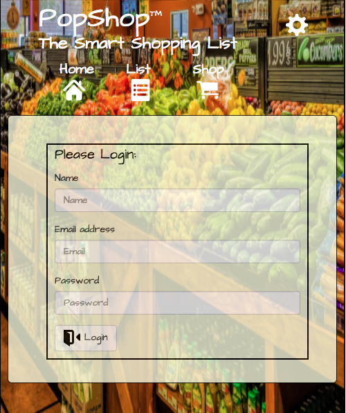

# PopShop

#### *PopShop - The Smart Shopper's Assistant.*

PopShop that helps make shopping easier, for those who might be a bit forgetful, or for people who just need keep their focus on the important things
By creating categorized item lists (i.e. electronic, hardware, grocery, etc.), shopping lists will pop up on demand or when shoppers are in the vacinity of a store that matches a list that the client created. 
    
During a shopping session a corresponding list of items will pop up in a clickable notification. As the shopper purchases items, they are checked off and stored for later analysis and use. When the next shopping session occurs, the list will display the most purchased items at the top of the queue. Items that are not purchased will simply drop off after a set period of time. As time progresses, a series of "smart" lists will have been constructed and will execute each time the shopper enters or approaches a corresponding retail establishment.      

*Additional functionality:*     
PopShop enables easy expansion by creating and/or modifying new or existing lists to meet specific shopping needs;
For active lists, PopShop can find the nearest x stores, x miles from the current location, that sell specific items;
PopShop can display current purchasing trends and enable forecasting for future purchasing decisions;